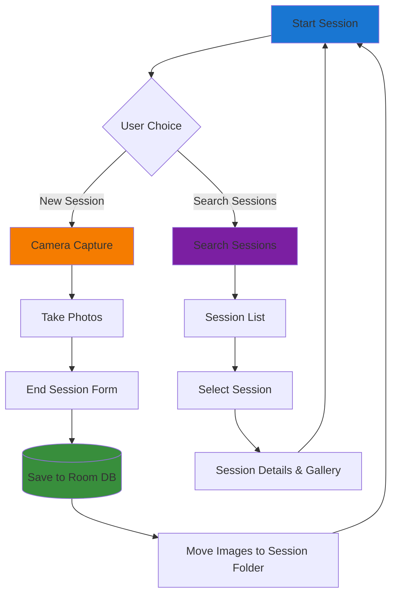

# Visident - Session-Based Camera App

<div align="center">


*A session-based camera app for capturing and organizing photo sessions, built with Jetpack Compose and Material 3 Expressive.*

</div>

## Overview

Visident is an Android application for organizing photography sessions. Users can create sessions, capture multiple images per session, store metadata, and search through their sessions.

## Features

### Core Functionality
- **Session-Based Image Capture**: Organize photos into distinct sessions
- **Real-time Camera Preview**: Live camera feed using CameraX Compose integration
- **Camera Controls**: Flash toggle, front/rear lens switch, tap-to-focus
- **Metadata Management**: Store session details (ID, name, age, timestamp, image count)
- **Image Gallery**: View captured images in an organized grid layout with pinch-to-zoom viewer
- **Search & Filter**: Find sessions by name or session ID (reactive, SQL-filtered)
- **Session Delete/Edit**: Delete sessions with folder cleanup; edit session metadata in-place
- **Swipe-to-Delete**: Dismiss sessions with a swipe gesture in the list
- **Scoped Storage**: App-specific external storage following Android best practices

### User Experience
- **Material 3 Expressive Design**: Uses `MaterialExpressiveTheme` with expressive components and a teal-seeded dynamic color scheme
- **Dark/Light Theme Support**: System-aware theme with Material You dynamic color (API 31+) falling back to the Visident brand palette
- **Custom Typography**: Google Fonts (Inter) integration
- **Edge-to-Edge**: Full-screen immersive layout

## Architecture & Tech Stack

### UI Layer
```
┌─────────────────────────────────────────────┐
│                Jetpack Compose              │
├─────────────────────────────────────────────┤
│ • Material 3 Expressive Components          │
│ • Custom Theme & Typography                 │
│ • Compose Navigation (Type-Safe Routes)     │
│ • CameraX Compose Integration               │
│ • Coil 3 for Image Loading                  │
│ • Google Fonts Integration                  │
└─────────────────────────────────────────────┘
```

### Business Logic Layer
```
┌─────────────────────────────────────────────┐
│               MVVM Pattern                  │
├─────────────────────────────────────────────┤
│ • HiltViewModel with Dependency Injection   │
│ • CaptureViewModel (camera sub-flow)        │
│ • LibraryViewModel (search + detail)        │
│ • StateFlow for Reactive State Management   │
│ • Coroutines for Asynchronous Operations    │
│ • Repository Pattern for Data Access        │
└─────────────────────────────────────────────┘
```

### Data Layer
```
┌─────────────────────────────────────────────┐
│              Data Persistence               │
├─────────────────────────────────────────────┤
│ • Room Database (SQLite) with reactive Flow │
│ • DAO Pattern for Database Operations       │
│ • Entity Classes with Annotations           │
│ • App-Specific External Storage             │
└─────────────────────────────────────────────┘
```

### Infrastructure Layer
```
┌─────────────────────────────────────────────┐
│          Dependency Injection               │
├─────────────────────────────────────────────┤
│ • Hilt for DI Container                     │
│ • Modules for Dependency Provision          │
│ • Scoped Components (Singleton, Activity)   │
│ • KSP for annotation processing             │
└─────────────────────────────────────────────┘
```

## Project Structure

```
app/src/main/java/dev/vaibhavp/visident/
├── MainActivity.kt                    # Entry point with Hilt & Compose setup
├── VisidentApplication.kt             # Application class with Hilt initialization
│
├── data/                              # Data layer components
│   ├── db/
│   │   ├── AppDB.kt                   # Room database definition
│   │   └── SessionDao.kt              # Data access object for sessions
│   └── model/
│       └── SessionEntity.kt           # Room entity for session metadata
│
├── di/                                # Dependency injection modules
│   ├── DatabaseModule.kt              # Provides database dependencies
│   └── RepositoryModule.kt            # Provides repository dependencies
│
├── repo/                              # Repository pattern implementation
│   └── SessionRepository.kt           # Data access abstraction layer
│
├── ui/                                # User interface components
│   ├── components/
│   │   ├── SessionDetailsCard.kt      # Reusable session card component
│   │   └── ZoomableImage.kt           # Pinch-to-zoom image viewer
│   ├── navigation/
│   │   ├── AppNavHost.kt              # Navigation host with nested capture graph
│   │   └── AppNavigation.kt           # Type-safe navigation routes
│   ├── search/
│   │   └── SearchSessionScreen.kt     # Session search & filtering UI
│   ├── session/
│   │   ├── CameraCaptureScreen.kt     # Camera preview & capture UI
│   │   ├── EndSessionScreen.kt        # Session metadata input form
│   │   ├── SessionDetailScreen.kt     # Session details & image gallery
│   │   └── StartSessionScreen.kt      # App home screen
│   └── theme/
│       ├── Color.kt                   # Full light/dark color schemes
│       ├── Shape.kt                   # Material 3 shape scale
│       ├── Theme.kt                   # MaterialExpressiveTheme configuration
│       └── Type.kt                    # Typography with Google Fonts
│
├── util/                              # Utility classes
│   ├── CameraUtility.kt               # CameraX helper functions
│   └── FileUtils.kt                   # File operations & storage management
│
└── viewmodel/                         # ViewModels for state management
    ├── CaptureViewModel.kt            # Camera session: preview, capture, controls
    └── LibraryViewModel.kt            # Session list, search, delete/edit
```

## Technologies Deep Dive

### Android Architecture Components

| Component | Version | Purpose |
|-----------|---------|---------|
| **Kotlin** | `2.3.21` | Language (via AGP 9 built-in Kotlin) |
| **AGP** | `9.2.1` | Android Gradle Plugin |
| **Gradle** | `9.5.1` | Build system |
| **Jetpack Compose UI** | `1.12.0-alpha03` | Modern declarative UI toolkit |
| **Material 3 Expressive** | `1.5.0-alpha21` | Design system with expressive components |
| **Navigation Compose** | `2.9.8` | Type-safe navigation with serialization |
| **Room Database** | `2.8.4` | SQLite abstraction with compile-time verification |
| **Hilt** | `2.59.2` | Dependency injection framework |
| **CameraX** | `1.6.1` | Modern camera API with Compose integration |
| **Lifecycle** | `2.10.0` | Lifecycle-aware components |
| **Coil** | `3.4.0` | Image loading (`io.coil-kt.coil3`) |
| **compileSdk / targetSdk** | `37` | Target Android platform |
| **minSdk** | `26` | Android 8.0 minimum |
| **Java** | `17` | JVM target |

### Key Libraries

```kotlin
// UI & Design
implementation("androidx.compose.material3:material3:1.5.0-alpha21")
implementation("androidx.compose.ui:ui-text-google-fonts:1.12.0-alpha03")
implementation("io.coil-kt.coil3:coil-compose:3.4.0")

// Camera & Permissions
implementation("androidx.camera:camera-compose:1.6.1")
implementation("com.google.accompanist:accompanist-permissions:0.37.3")

// Database & Storage
implementation("androidx.room:room-ktx:2.8.4")
ksp("androidx.room:room-compiler:2.8.4")

// Dependency Injection
implementation("com.google.dagger:hilt-android:2.59.2")
ksp("com.google.dagger:hilt-android-compiler:2.59.2")

// Navigation & State
implementation("androidx.navigation:navigation-compose:2.9.8")
implementation("org.jetbrains.kotlinx:kotlinx-serialization-json:1.11.0")

// Logging
implementation("com.jakewharton.timber:timber:5.0.1")
```

## Application Flow Diagram


```mermaid
graph TD
    A[Start Session] --> B{User Choice}
    B -->|New Session| C[Camera Capture]
    B -->|Search Sessions| D[Search Sessions]

    C --> E[Take Photos]
    E --> F[End Session Form]
    F --> G[(Save to Room DB)]
    G --> H[Move Images to Session Folder]
    H --> A

    D --> I[Session List]
    I --> J[Select Session]
    J --> K[Session Details & Gallery]
    K --> A

    style A fill:#1976d2
    style C fill:#f57c00
    style D fill:#7b1fa2
    style G fill:#388e3c
```

## Database Schema

```sql
CREATE TABLE sessions (
    sessionId TEXT PRIMARY KEY NOT NULL,
    name TEXT NOT NULL,
    age INTEGER NOT NULL,
    createdAt INTEGER NOT NULL,
    imageCount INTEGER NOT NULL
);
```

### Room Database Architecture
```
SessionEntity.kt
├── @Entity(tableName = "sessions")
├── @PrimaryKey sessionId: String
├── name: String
├── age: Int
├── createdAt: Long (timestamp)
└── imageCount: Int

SessionDao.kt
├── @Insert(onConflict = REPLACE)
├── @Update
├── @Delete
├── @Query observeAllSessions(): Flow<List<SessionEntity>>
├── @Query searchSessions(query): Flow<List<SessionEntity>>
└── @Query getSessionById(id): SessionEntity?

AppDB.kt
├── @Database(entities = [SessionEntity::class], version = 1)
├── abstract fun sessionDao(): SessionDao
└── RoomDatabase()
```

## File Storage Architecture

```
Device Storage
└── Android/media/dev.vaibhavp.visident/
    └── Sessions/
        ├── session_20250903_001/
        │   ├── IMG_20250903_143052.jpg
        │   ├── IMG_20250903_143105.jpg
        │   └── IMG_20250903_143118.jpg
        ├── session_20250903_002/
        │   ├── IMG_20250903_150221.jpg
        │   └── IMG_20250903_150234.jpg
        └── cache/
            └── temp_images/
```

### Storage Benefits
- **Scoped Storage Compliant**: No `WRITE_EXTERNAL_STORAGE` permission needed
- **App-Specific**: Files automatically cleaned up on app uninstall
- **Organized Structure**: Sessions grouped by unique identifiers
- **Cache Management**: Temporary files handled separately

## Getting Started

### Prerequisites
- **Android Studio**: Ladybug (2024.2) or newer
- **Minimum SDK**: 26 (Android 8.0)
- **Target SDK**: 37
- **Java Version**: 17
- **Gradle**: 9.5.1

### Quick Setup

1. **Clone the repository**
   ```bash
   git clone https://github.com/vaibhavppandey/visident.git
   cd visident
   ```

2. **Open in Android Studio**
   - Import the project
   - Sync Gradle files
   - Build the project

3. **Run the application**
   ```bash
   ./gradlew assembleDebug
   # Or use Android Studio's run button
   ```

## Permissions

| Permission | Purpose | Request Method |
|------------|---------|----------------|
| `CAMERA` | Camera access for image capture | Runtime via Accompanist |
| ~~`WRITE_EXTERNAL_STORAGE`~~ | Not needed | App-specific storage used |

## Key Features Demonstrated

### Architecture Patterns
- **MVVM**: Clear separation of concerns
- **Repository Pattern**: Abstracted data access
- **Dependency Injection**: Hilt for compile-time safety
- **State Management**: Reactive UI with StateFlow
- **Clean Architecture**: Layered approach

### Modern UI/UX
- **Jetpack Compose**: 100% declarative UI
- **Material 3 Expressive**: Latest design system with expressive motion and components
- **Type-Safe Navigation**: Kotlinx Serialization
- **Custom Typography**: Google Fonts integration
- **Responsive Design**: Adaptive layouts

### Data Management
- **Room Database**: Local data persistence with reactive Flow queries
- **Coroutines**: Asynchronous operations
- **File Management**: Scoped storage implementation
- **Image Loading**: Coil 3 integration

### Modern Android Development
- **CameraX Integration**: Modern camera API with flash, lens switch, tap-to-focus
- **Permission Handling**: Runtime permission requests
- **Edge-to-Edge**: Modern navigation experience
- **KSP**: Kotlin Symbol Processing for annotation processing (Room + Hilt)

## Build & Deploy

### Local Development
```bash
# Debug build
./gradlew assembleDebug

# Release build
./gradlew assembleRelease

# Run tests
./gradlew test

# Clean build
./gradlew clean build
```

## License

This project is licensed under the **MIT License** - see the [LICENSE](LICENSE) file for details.

```
MIT License

Copyright (c) 2025

Permission is hereby granted, free of charge, to any person obtaining a copy
of this software and associated documentation files (the "Software"), to deal
in the Software without restriction, including without limitation the rights
to use, copy, modify, merge, publish, distribute, sublicense, and/or sell
copies of the Software, and to permit persons to whom the Software is
furnished to do so, subject to the following conditions:

The above copyright notice and this permission notice shall be included in all
copies or substantial portions of the Software.

THE SOFTWARE IS PROVIDED "AS IS", WITHOUT WARRANTY OF ANY KIND, EXPRESS OR
IMPLIED, INCLUDING BUT NOT LIMITED TO THE WARRANTIES OF MERCHANTABILITY,
FITNESS FOR A PARTICULAR PURPOSE AND NONINFRINGEMENT. IN NO EVENT SHALL THE
AUTHORS OR COPYRIGHT HOLDERS BE LIABLE FOR ANY CLAIM, DAMAGES OR OTHER
LIABILITY, WHETHER IN AN ACTION OF CONTRACT, TORT OR OTHERWISE, ARISING FROM,
OUT OF OR IN CONNECTION WITH THE SOFTWARE OR THE USE OR OTHER DEALINGS IN THE
SOFTWARE.
```

---

Built with Jetpack Compose, Material 3 Expressive, Room, CameraX, and Hilt.
